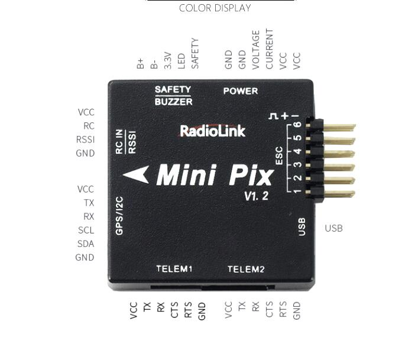

# Controladora de voo

## Mini Pix

A controladora escolhida foi a Mini Pix V1.0. Este modelo é baseado na arquitetura da PixHawk.

!!! warning 

    Cuidado na escolha da controladora, este modelo foi escolhido após estudo profundo do firmware que seria usado o [ArduPilot](https://ardupilot.org/). E a sua documentação conta com um aviso sobre esse modelo de controladora, falando basicamente:
    
    > Algumas versões dessa controladora não são **recomendadas** devido a uma possivel incompatibilidade.

    > “V1.0” e “V1.2” provavelmente funcionam, “V1.0 II” e “V1.1” definitivamente não funcionam.

    Essa documentação pode ser encontrada [aqui](https://ardupilot.org/copter/docs/common-radiolink-minipix.html).

## ArduPilot

O firmware ArduPilot foi escolhido devido a sua flexibilidade e facilidade de integração com os outros componentes requeridos pelo projeto.
