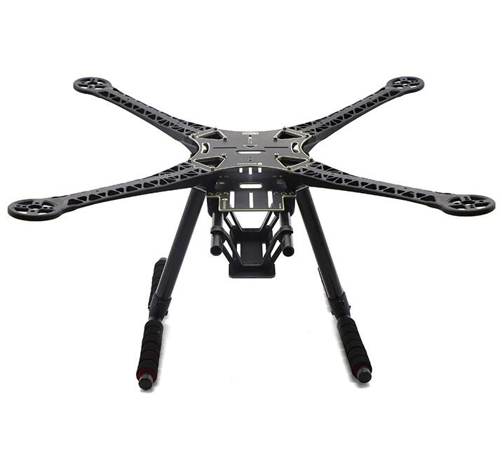
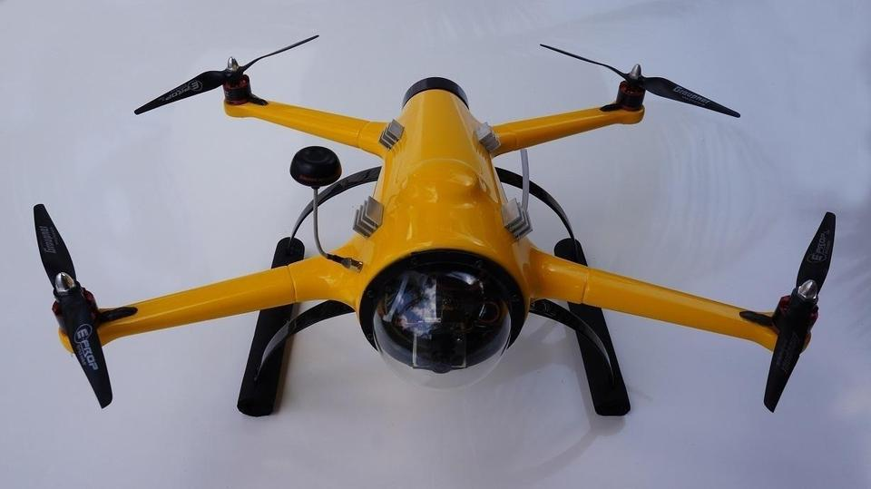
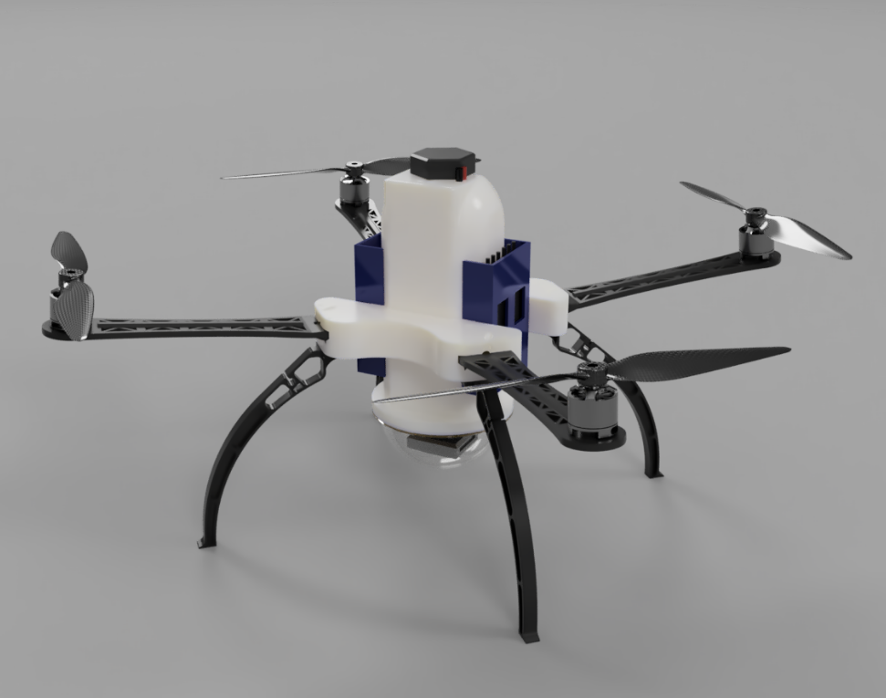

# Frame

Durante todo o desenvolvimento sempre foram utilizados 2 tipos de frames.

## **Frame de validação**

*  Utilizado para testar tecnologias;

* Fácil acesso para facilitar a iteração e modificação de hardware;

* Foi utilizado o frame **s500** da dji. Uma plataforma um pouco defasada a este ponto, entretanto com bastante material disponível.

{ width="300"}

___

## **Frame final**

Ao decorrer do projeto o **frame aprova d'água** foi alterado por diversas vezes. Os notáveis serão apresentados a seguir.

### QuadH2o

O projeto teve como seu frame inicial o QuadH2o, entretanto devido a sua descontinuação se tornou inviável para o projeto.

{ width="300"}

___

### Custom

Esse foi o **{==frame final==}**, o desenho foi feito utilizando o [Fusion 360](https://www.autodesk.com/products/fusion-360/overview) e seu `.step` está disponível em [EM BREVE](#).

Seu corpo principal foi impresso em uma impressora 3d e canibalizou os braços e trem de pouso da [s500](#1-frame-de-validacao).

{ width="300"}

___