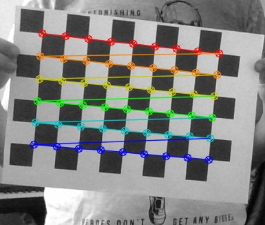

# Calibração da câmera

Para a aquisição de leituras e estimação de distâncias é imprescindível uma boa calibração da câmera.

A camera utilizada neste projeto foi a [Raspberry Pi Camera Module 2](https://www.raspberrypi.com/products/camera-module-v2/).

Este projeto possui scripts de Python para calibrar a câmera. O processo de calibração segue os seguinte passos:

1. `CaptureImg.py `: Este scripts irá tirar fotos e armazenar as mesmas.
2. `aprilCalibrateCam.py`: Este script realizará os cálculos e irá gerar uma **matriz de distorção**. 

> Esses scripts foram derivados do repositório [Basic-Augmented-reality-course-opencv](https://github.com/Asadullah-Dal17/Basic-Augmented-reality-course-opencv), por favor o visite e deem as atribuições necessárias.

## Capturando imagens

Siga os passos a seguir para capturar as imagens:

1. Imprima o [chessboard pattern](https://github.com/opencv/opencv/blob/4.x/doc/pattern.png).
> { width="300"}

2. Deixe **plano** fixando-o à alguma superfície.
> Por exemplo um pedaço de madeira, isopor ou qualquer outro material plano.

3. Coloque as **dimensões** no script `CaptureImg.py`
    ``` python
    # Dimensão do tabuleiro
    CHESS_BOARD_DIM = (9, 6)
    ```
> Note que o numero começa em 0, ou seja, se o *pattern* possui 10 x 7, você colocará `CHESS_BOARD_DIM = (9, 6)`.

4. Inicie o script e pressione `s` para salvar uma foto, ou `q` para finalizar o programa.
    * É importante que sejam tiradas fotos com o *pattern* em posições e inclinações diferentes, principalmente nas **bordas** do campo de visão da câmera;
    * Para um bom resultado recomendo tirar pelo menos **30 fotos diferentes**.

Ao finalizar o programa você terá um diretório chamado `/images/` na *root* do projeto.

___

## Gerando matriz

Neste passo será gerado a matriz de calibração ela irá gerar uma matriz que você deverá **copiar** e coloca-lo no script principal.

Siga as instruções a seguir para realizar a calibração com sucesso.

### Setup

* Abra o arquivo `aprilCalibrateCam.py` em seu editor de preferencia.

* O primeiro passo é colocar os parâmetros do *chessboard pattern*. Altere os seguintes parâmetros:
    ``` python
    CHESS_BOARD_DIM = (9, 6)
    SQUARE_SIZE = 26  # - mm
    ```

    * `CHESS_BOARD_DIM` deverá conter os mesmos valores dos colocados no [item anterior](#capturando-imagens).
    * `SQUARE_SIZE` deverá conter o tamanho em `mm` dos quadrados do seu *pattern*.


### Apuração

* Após o setup das constantes o próximo passo será **apurar** as imagens. Ao iniciar o arquivo serão apresentadas as imagens que foram capturadas com as linhas de calibração.

    Exemplo:
    > { width="300"}

    > O exemplo acima é uma base de como as suas imagens devem estar, sem linhas cruzadas e com todos os cantos identificados.

    * O script irá iterar sobre todas as imagens no diretório `/images/`

    * Você devera pressionar `s` para **aceitar** a imagem, `q` para **encerrar** ou qualquer outra letra para **rejeitar**.

    Ao fim será impresso na tela uma matriz como a seguinte: 
    ``` python title=""
    cam_params = (643.2857240774916, 644.3167085172134, 336.7788196007684, 231.26676197077208)
    ```

    Você deverá copiar essa linha para adiciona-la  ao script principal posteriormente.

    !!! warning
        O plano inicial era gerar um arquivo `.npz` e guardar a matriz lá, entretanto essa *feature* não foi implementada ainda.

## Aplicando calibração

Para aplicar a calibração siga os passo a seguir:

1. Abra o script principal `2aprilTagDetect.py`

2. Altere a variável `cam_params` com seus valores próprios
    ``` python
    # Parametros gerados do script aprilCalibrateCam.py
    cam_params = (
        630.8669379442165,
        630.3123204518172,
        335.75042566981904,
        227.83332282734318,
    )
    ```